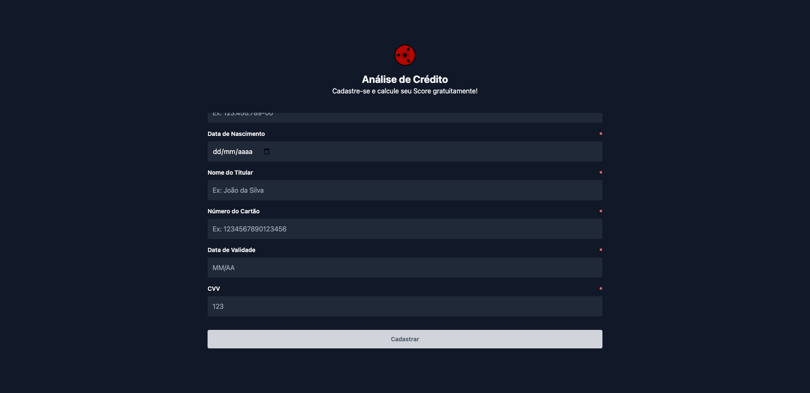

# DocnixScoreForm

## About the project

Project for client registration generated with [Angular CLI](https://github.com/angular/angular-cli) version 17.3.10.

## Build

Run `ng build` to build the project. The build artifacts will be stored in the `dist/` directory.

## Development server

Run `ng serve` for a dev server. Navigate to `http://localhost:4200/`. The application will automatically reload if you change any of the source files.

## Running unit tests

Run `ng test` to execute the unit tests via [Karma](https://karma-runner.github.io).
